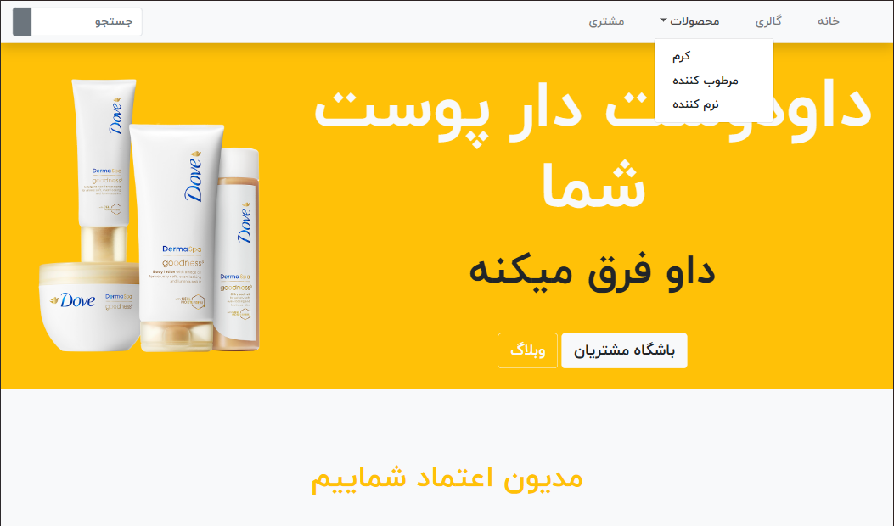
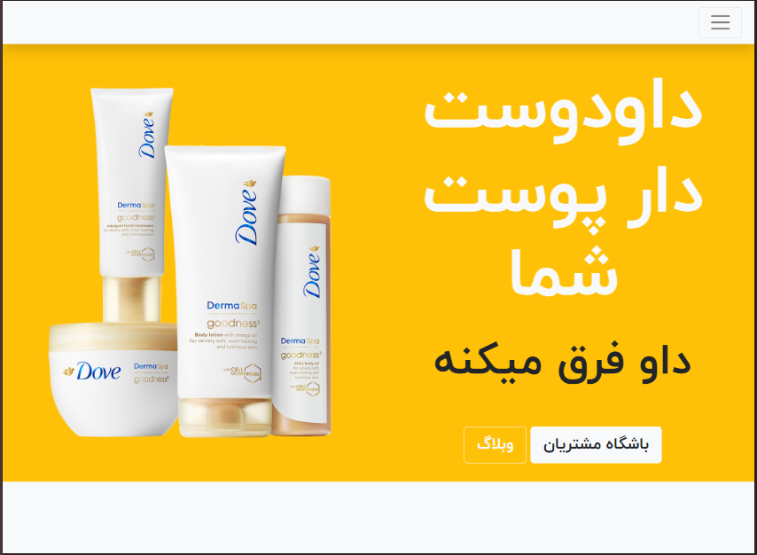
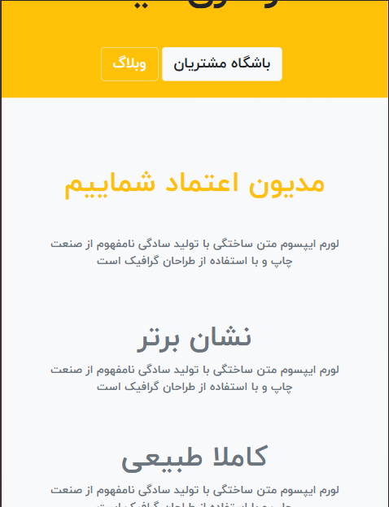
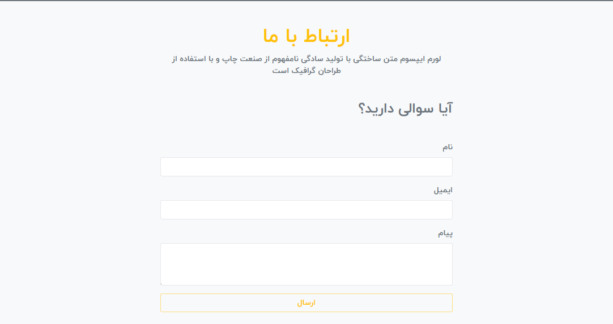

# Dove Project

[](https://opensource.org/licenses/MIT)
[](https://github.com/sajjad-sisakhtpour/dove-project)
[](https://ir.linkedin.com/in/sajad-sisakht-pour)

## Overview

Dove Project is a user-friendly front-end template designed for showcasing products and building an appealing web presence. It incorporates a responsive navbar, banners, product sections, and blog previews, making it ideal for small businesses and personal portfolio sites.

---

## Prerequisites

- **Node.js**: Ensure you have Node.js installed. It can be downloaded from [Node.js Official Site](https://nodejs.org).
- **Git**: Clone the repository using Git.

---

## Installation

1. **Clone the repository**:
   ```bash
   git clone https://github.com/sajjad-sisakhtpour/dove-project.git
   cd dove-project
   ```

2. **Install dependencies** (if required):
   ```bash
   npm install
   ```

---

## Usage

1. Open `index.html` in a web browser to view the project.
2. For development, use [Live Server](https://marketplace.visualstudio.com/items?itemName=ritwickdey.LiveServer) on VS Code or a similar tool to view updates in real-time.

---

## Examples

Here is a sample usage of the project as a product showcase:

```html
<a href="#" class="navbar-brand text-warning mx-3">
  <i class="fas fa-dove"></i> Dove Project
</a>
```

---

## Documentation

### Project Structure

- **HTML/CSS/JS**: Built with vanilla HTML and CSS, incorporating FontAwesome icons and Bootstrap for styling.
- **Responsive Design**: Supports responsive layouts for different screen sizes.

### Features

- **Navbar**: A collapsible navbar with sections for home, gallery, products, and customer area.
- **Banner**: A hero section with a CTA for customer club and blog.
- **Product Showcase**: Displays product categories like cream, moisturizer, and conditioner.
- **Blog Section**: Highlights recent posts with interactive social links.

---

## Screenshots






---

## Contributing

Contributions are welcome! Please fork the repository and submit a pull request. For major changes, open an issue first to discuss your ideas.

1. **Fork the Project**
2. **Create your Feature Branch** (`git checkout -b feature/AmazingFeature`)
3. **Commit your Changes** (`git commit -m 'Add some AmazingFeature'`)
4. **Push to the Branch** (`git push origin feature/AmazingFeature`)
5. **Open a Pull Request**

---

## License

This project is licensed under the MIT License. See the [LICENSE](LICENSE) file for details.

---

## Contact

**Sajjad Sisakhtpour**  
- GitHub: [github.com/sajjad-sisakhtpour](https://github.com/sajjad-sisakhtpour)
- LinkedIn: [ir.linkedin.com/in/sajad-sisakht-pour](https://ir.linkedin.com/in/sajad-sisakht-pour)
- Email: [sajjad.sisakhtpour@gmail.com](mailto:sajjad.sisakhtpour@gmail.com)

---

## Live Demo

To see the live demo, visit: [Dove Project Demo](#)